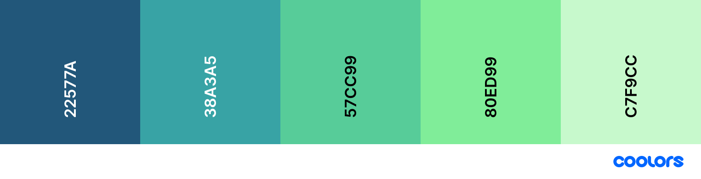

The idea for this project is to display a running analogue clock that shows both the current time for the user and an additional
clock where a city name can be searched for and the current local time for that city will be displayed.


 


## Contents ##

- [Contents](#contents)
- [UX (User Experience)](#ux-user-experience)
  - [Project Goals](#project-goals)
  - [User Goals](#user-goals)
  - [User Stories](#user-stories)
  - [Site Owner Goals](#site-owner-goals)
- [Design Choices](#design-choices)
  - [Fonts](#fonts)
  - [Colours](#colours)
  - [Wireframes](#wireframes)
    - [Hand drawn drafts](#hand-drawn-drafts)
    - [Final Wireframes](#final-wireframes)
- [Technologies](#technologies)
  - [Languages](#languages)
  - [Libraries](#libraries)
  - [Tools](#tools)
- [Features](#features)
  - [Features Implemented](#features-implemented)
  - [Future Features](#future-features)
- [Version Control](#version-control)
    - [Gitpod Workspaces](#gitpod-workspaces)
    - [Branches](#branches)
    - [Working within a branch](#working-within-a-branch)
    - [Merging branches in GitHub](#merging-branches-in-github)
    - [Update Gitpod with the latest GitHub commits](#update-gitpod-with-the-latest-github-commits)
- [Project Management](#project-management)
- [Testing](#testing)
- [Bugs](#bugs)
- [Deployment](#deployment)
  - [Running world-clock Locally](#running-world-clock-locally)
- [Credits](#credits)
  - [Images](#images)
  - [Colour](#colour)
  - [Inspiration](#inspiration)
  - [Acknowledgements](#acknowledgements)

---

## UX (User Experience) ##

### Project Goals ###

The **goal** of this project is to build a a website that displays both local and a searchable city time.

The **features** on the website will:

- Show a running analogue clock with the user's current local time.
- Show an additional analogue clock where the user can search for the local time in another city.
- Provide an alarm clock feature that can be set for the user's local time.

I achieve this by:

- Building the clock functionality using HTML `<canvas>` elements to draw the clock face and hands.
- Using Timezone API data to ruturn current time of cities the user has searched for.
- Allowing the user to set an alarm time, switch the alarm on or off and an alarm cancel button.
- Providing an option to the customers to submit their contact and request details in a form.

### User Goals ###

- **Show** the current local time.
- **Search** for the local time in another city.
- **Set** an alarm clock using the current local time.

### User Stories ###

- As a **user**, I want to see a running clock telling the curent local time.
- As a **user**, I want to be able to see the times as AM or PM.
- As a **user**, I want to set an alarm clock.
- As a **user**, I want to hear an audible alarm sound and see a visual alarm cue at the set alarm time.
- As a **user**, I want to see a second clock displaying the local time for a city I've chosen.
- As a **user**, I want to see a search ba where I can search for a city name.
- As a **user**, I want to see the current data and timezone information.
- As a **user**, I want the site to remember my choices.
- As a **user**, I want to send the site owner comments via email.

### Site Owner Goals ###

- As a **site owner**, I want to create an **interactive website** to present a clean, easy to understand display of information.
- As a **site owner**, I want the **user** to be able to have the last searched city name to be remembered for the next session.
- As a **site owner**, I want the **user** to be able to see errors displayed in a user friendly way.
- As a **site owner**, I want the **user** to be able to see or hear an alarm clock.

--- 

## Design Choices ##

### Fonts ###

I have chosen [Castoro](https://fonts.googleapis.com/css2?family=Castoro&display=swap) for all of the text.

### Colours ###

I have chosen the colours that blend and transition smoothly together. The animated background gradient colours give a pleasing, subtle effect and allows the clock face and accordions to stand out.


- *Blue Sapphire* (22577A) - Dark Blue
- *Cadet Blue* (38A3A5) - Turquoise
- *Medium Aquamarine* (57CC99) - Blue / Green
- *Light Green* (80ED99) - Light Green
- *Tea Green* (c7F9CC) - Pale Green

These colours will compliment each other well when they transition from one colour to another to create a subtle but pleasing background.

### Wireframes ###

I designed the site mock-ups originally using pen and paper and then developing the designs further using [Balsamiq wireframes](https://balsamiq.com/).

I'm focusing on defining the basic layout structure of the site and identifying how displays would change on different screen sizes such as mobile, tablet and desktop for each page.

#### Hand drawn drafts ####

The original hand drawn sketch wireframe was created as quick and rough method to try out page formatting ideas to form a basis for creating the wireframe within balsamic.

It represents the early stages of the design process for the website as ideas started to form and the flow of the design process from idea to finished website.
- [Homepage](wireframes/wireframe-mobile-homepage-draft.png)


#### Final Wireframes ####

The final wireframes were created using Balsamiq adapted from the original hand drawn wireframe concepts. The image shows the homepage from the site in three display sizes to demonstrate the page design and layout.

- [Homepage](wireframes/wireframes-homepage.png)

---  

## Technologies ##

### Languages ###

- [HTML5](https://developer.mozilla.org/en-US/docs/Web/HTML)
  - Used as the main markup language for the website content.
- [CSS3](https://developer.mozilla.org/en-US/docs/Web/CSS)
  - Used to style the individual webpages.
- [JavaScript](https://developer.mozilla.org/en-US/docs/Web/JavaScript)
  - Used to create the interactive functionality of the website

### Libraries ###

- [Bootstrap](https://getbootstrap.com/)
  - Used to design a mobile-first responsive website layout.
- [jQuery](https://jquery.com/)
  - Loaded as part of the [Bootstrap CDN starter template](https://getbootstrap.com/docs/4.5/getting-started/introduction/#starter-template)
- [Popper](https://popper.js.org/)
  - Loaded as part of the [Bootstrap CDN starter template](https://getbootstrap.com/docs/4.5/getting-started/introduction/#starter-template)
- [Jasmine.js](https://jasmine.github.io/pages/getting_started.html)
  - Used to create test-driven development of the JavaScript files


### Tools ###

- [Git](https://git-scm.com/)
  - Git was used for version control by utilising the Gitpod terminal to commit to Git and push to GitHub.
- [GitHub](https://github.com/)
  - Used to store, host and deploy the project files and source code after being pushed from Git.
- [Gitpod](https://www.gitpod.io/)
  - An online IDE linked to the GitHub repository used for the majority of the code development.
- [CodePen](https://codepen.io/simonjvardy/)
  - An online code editor and open-source learning environment used to test small sections of code quickly and easily.
- [Visual Studio Code](https://code.visualstudio.com/)
  - A locally installed IDE connected to the GitHub repository for when there was no internet connection to use Gitpod.
- [Font-Awesome](https://fontawesome.com/icons?d=gallery)
  - Used for icons to enhance headings and add emphasis to text.
- [Google fonts](https://fonts.google.com/)
  - Used for the website fonts.
- [Coolors](https://coolors.co/)
  - An online tool used to choose the website colour scheme.
- [Favicons](https://favicon.io/)
  - Used to generate a favicon for the website title.
- [Am I Responsive?](http://ami.responsivedesign.is/)
  - A tool for taking a quick snapshot of the responsive breakpoints of the website to visualise how the site will look on different device screen sizes in one place. The resulting screenshot is also used as the README.md logo image.
- [What is my Screen Resolution](http://whatismyscreenresolution.net/)
  - An online tool to find out the screen resolution on your device used for CSS @media queries
- [CSS Gradient Animator](https://www.gradient-animator.com/)
  - An online tool to test and generate custom CSS for animated background colour gradient effects.

---

## Features ##

### Features Implemented ###

- Responsive mobile first design using a [Bootstrap](https://getbootstrap.com/) framework.
- User friendly display
- A search bar for users to search for city names
- An alarm clock with time input, on/off toggle switch and a cancel button

  
### Future Features ###

- Allow users to see location weather data

---
## Version Control ##
**Version control** for this repository is managed within **GitHub** and **Gitpod** using separate [branches](https://github.com/simonjvardy/world-clock/branches)  used to work on specific aspects of the project.
The following describes the repository branch structure:
- **Master** - this is the default branch and the source for the repository deployment.
    - **Documentation** - this branch is used for updating the README.md and testing.md documentation only.
    - **Development** - this branch is used as the main working branch for the website development
    - Each individual **bug fixes** are raised within their own **separate branches** using the naming convention **\<GitHub Issue ID Number>-\<bug fix description>** e.g. branch name ***12-correct-navbar-links*** 

The following workflow steps are used to create and update branches within Gitpod and to push changes back to GitHub.

#### Gitpod Workspaces ####
1. Open **Gitpod** from **Github** using the Gitpod button. This needs to only be done **once** at the start of the project.
2. Start the Gitpod Workspace which opens an **online IDE editor** window.

#### Branches ####
3. For changes to be made to any **documentation files**, the git command `git checkout documentation` is used to checkout and switch to the **documentation branch**.
4. For changes to be made to **other files** under normal site development, the git command `git checkout development` is used to checkout and switch to the **development branch**.
5. To create a **new branch** for bug fixes, use the git command `git checkout -b <branch-name>` to **create and switch** to the new branch.

#### Working within a branch ####
6. **New** or **modified** files are **staged** using the `git add .` command
7. The changes are **committed** using `git commit -m "<commit message>"` command.
8. If the changes are in a newly created branch, the **committed** changes are **pushed** from Gitpod to GitHub using the `git push --set-upstream origin <branch-name>` command as there is currently no upstream branch in the remote repository.
9. For branches that have already been synchronised, the **committed** changes are **pushed** from Gitpod to GitHub using the `git push` command.

#### Merging branches in GitHub ####
10. Opening the repository in Github, a new **pull request** is created for the updated branch and assigned to the **Development project**.
11. The changes are **reviewed** to ensure there are **no conflicts** between the **updated branch** and the **Master branch**.
12. The changes are then **merged** into the **Master branch** and the merge request is **closed**. The **Project entry** is **automatically** moved to the **Done** card.

#### Update Gitpod with the latest GitHub commits ####
13. To update Gitpod with the **latest commits** From GitHub, the `git checkout master` command is used to checkout and switch to the master branch.
14. Use the `git pull` command to update the master branch and **reset the pointer**.
15. Now **switch** to the **other branches** in Gitpod using the `git checkout <branch-name>` command and use the `git merge origin/master` command to **update each branch in turn**.
16. Use the `git push` on **each branch** to update the relevant GiHub Branches to the **same commit** as the **Master branch**.
17. **Repeat steps 3 - 17 regularly** to ensure updates are **saved** and **correctly version controlled** in GitHub.

---

## Project Management ##

GitHub [Projects](https://github.com/simonjvardy/world-clock/projects) are used to organise the planning and development of the website.
Three GitHub projects are used to manage different aspects of the site development:
- [Development](https://github.com/simonjvardy/world-clock/projects/1)
  - Manages general project tasks and files including HTML & CSS
- [Development - JavaScript](https://github.com/simonjvardy/world-clock/projects/2)
  - Manages tasks relating to the development of the JavaScript functionality
- [Bug Fixes](https://github.com/simonjvardy/world-clock/projects/3)
  - Manages the triage and prioritisation of the bug fixes.

The Projects are created using the following GitHub templates:
- `Automated kanban` template for the **Development** and **Development - JavaScript** projects 
- `Bug Triage` template for the **Bug Fixes** project.

The following kanban project cards are used to manage the tasks:
- **Backlog** - this card is used to capture ideas for project tasks.
- **To Do** - this is the current work queue for the project.
- **In Progress** - this is the list of tasks currently in work.
    - New issues and pull requests are automatically added to this column using project card automation options.
- **Testing** - Testing tasks list
- **Done** - completed tasks

he following Bug Triage template project cards are used to manage the Bux fixes tasks:
- **Needs Triage** - this card is used to capture new bugs prior to assigning a priority.
  - A triage card is more appropriate for larger projects than this but left in as this is where all new issues are assigned when linking a project to a new issue.
- **High Priority** - this is the high priority queue for the project.
- **Low Priority** - this is the low priority queue for the project.
- **Closed** - completed tasks.

Markdown syntax is used to create **"To-Do" list** style checkboxes by adding `- [ ]` for an un-ticked checkbox and `- [x]` for a ticked checkbox on cards as a way of splitting a single complex task into a list of steps to be completed.


---
## Testing ##

- Testing information can be found in a separate [testing.md](testing.md) file.

---
## Bugs ##

To manage bugs and issues tracking, the default GitHub [bug_report.md template](https://github.com/simonjvardy/world-clock/blob/master/.github/ISSUE_TEMPLATE/bug_report.md) has been created and activated within the repository settings Features > Issues section.
All new bugs and issues are tracked within the GitHub repository [Issues section](https://github.com/simonjvardy/world-clock/issues) .
Open issues are managed within the [GitHub Projects section](https://github.com/simonjvardy/world-clock/projects)

Each branch is then **merged** into the **master branch** using a **pull request** that is **linked** to the **open issue**. Once merged, and the bug report **closed**, the branch is **deleted**.

Fixed bugs and issues are marked as [closed](https://github.com/simonjvardy/world-clock/issues?q=is%3Aissue+is%3Aclosed).

---

## Deployment ##

The website was developed using both *Gitpod* and *Visual Studio Code* and using *Git* pushed to *GitHub*, which hosts the repository. I made the following steps to deploy the site using *GitHub Pages*:

- Opened up **GitHub** in the browser.
- Signed in with my **username** and **password**.
- Selected my **repositories**.
- Navigated to **simonjvardy/world-clock**.
- In the top navigation clicked **settings**.
- Scrolled down to the **GitHub Pages** area.
- Selected **Master Branch** from the **Source** dropdown menu.
- Clicked to **confirm** my **selection**.
- [world-clock](https://simonjvardy.github.io/world-clock/) is now **live** on **GitHub Pages**.

### Running world-clock Locally ###

Cloning world-clock from GitHub:

- Navigate to **simonjvardy/world-clock**.
- Click the green **Code** button.
- **Copy** the url in the dropdown box.
- Using your favourite **IDE** open up your preferred terminal.
- **Navigate** to your desired file location.

Copy the following code and input it into your terminal to clone world-clock:

```git clone https://github.com/simonjvardy/world-clock.git```

---

## Credits ##

### Images ###

You can find the images used for the site [here](assets/images). I have sourced them through various websites, which are either free to use or used under license:

- Homepage
  - The [Clock Face Background Image](assets/img/clock-face-circle.png) was sourced from [DeviantArt](https://www.deviantart.com/agf81/art/Clock-Face-2-169291889) and licensed under CC BY 3.0 Credit: [AGF81](https://www.deviantart.com/agf81)

- 404
  - The [Error 404 Text Background Image](assets/img/bg.jpg) was sourced from [Colorlib](https://colorlib.com/wp/free-404-error-page-templates/) as part of a template licensed under CC BY 3.0

### Colour ###

- The colour palette was identified on [Coolors](https://coolors.co/)
- The CSS colour gradient animations were generated on [CSS Gradient Animator](https://www.gradient-animator.com/)

### Inspiration ###

The following websites were used as the starting point and inspiration for creating the HTML Canvas clock code:
- [W3Schools](https://www.w3schools.com/graphics/canvas_clock.asp) Canvas Clock Tutorial.
- [dhtmlgoodies.com](http://www.dhtmlgoodies.com/tutorials/canvas-clock/) Excellent HTML Canvas clock tutorial
- [jQuery2DotNet](https://jsfiddle.net/lesson8/ezhzq/) HTML Canvas clock code example.
- [Script Tutorials](http://www.script-tutorials.com/html5-clocks/) HTML Canvas clock code example.


### Acknowledgements ###

- [Simon Vardy](https://github.com/simonjvardy/Aviation-Consultancy) MS-1 Project for the re-use of many ideas and code snippets.
- [W3Schools](https://www.w3schools.com/) for just being a constant source of help and inspiration!
- [Code Institute](https://codeinstitute.net/full-stack-software-development-diploma/) Course material for the inspiration from code-along challenges.
- [San Francisco State Univerity](https://its.sfsu.edu/projects/resources) PMO Resources webpage where the original Unit Testing and UAT Testing Plan documents were sourced
- [usersnap.com blog](https://usersnap.com/blog/user-acceptance-testing-example/) which was the inspiration for the modified UAT Testing document and wording.
- [Richard Read](https://github.com/Readri205/MS2_Project) for project inspiration and ideas.
- [Frozenaught](https://github.com/Frozenaught/homechopped) for further README.md content ideas.
- [Gary Simons](https://github.com/GarySimons/WildBunch-Florist) for further README.md content ideas.
- [Software Testing Fundamentals (STF)](http://softwaretestingfundamentals.com/) for an excellent guide on building testing processes.
- [Git - Branching and Merging](https://git-scm.com/book/en/v2/Git-Branching-Basic-Branching-and-Merging) documentation for help understanding how to manage branches in GitHub / Gitpod.
- [digitaljhelms](https://gist.github.com/digitaljhelms/4287848) for ideas and help with GitHub branch naming conventions.
- [TutorialRepublic](https://www.tutorialrepublic.com/twitter-bootstrap-tutorial/) for Boostrap help and tutorials.
- [Dev.Opera](http://dev.opera.com/articles/view/html-5-canvas-the-basics/) HTML5 canvas - the basics
- [Smashing Magazine](https://www.smashingmagazine.com/2010/10/local-storage-and-how-to-use-it/) Guide on Local Storage
- [GitHub](https://docs.github.com/en/free-pro-team@latest/github/working-with-github-pages/creating-a-custom-404-page-for-your-github-pages-site) Help guide on using Error 404 pages on repositories.
- [Colorlib](https://colorlib.com) the 404.html was made by Colorlib. Go visit their website for more awesome templates, themes and tools.
- [Jenkov.com](http://tutorials.jenkov.com/html5-canvas/text.html) tutorials on HTML5 Canvas.
- [Stack Overflow](https://stackoverflow.com/) For help fixing so many thing that fell over on this project!
  - [Stack Overflow](https://stackoverflow.com/questions/273695/what-are-some-examples-of-commonly-used-practices-for-naming-git-branches) for ideas and help with GitHub branch naming conventions.
  - [Stack Overflow](https://stackoverflow.com/questions/18541331/how-to-make-javascript-use-time-from-the-world-clock-gmt-to-be-specific) for ideas and help with making JavaScript use the world clock (GMT).
  - [Stack OVerflow](https://stackoverflow.com/questions/25095548/how-to-draw-a-circle-in-html5-canvas-using-javascript) for ideas and help with drawing circles using HTML Canvas elements and JavaScript
  - [Stack Overflow](https://stackoverflow.com/questions/3511200/new-image-how-to-know-if-image-100-loaded-or-not) for fixing the "wait until the image has fully loaded" problem with the clock background.
- [Bootstrap](https://getbootstrap.com/)
  - [Jumbotron](https://getbootstrap.com/docs/4.5/components/jumbotron/) example code was copied and adapted for the Home page CTA / Hero image.
  - [Cards](https://getbootstrap.com/docs/4.5/components/card/) example code was copied and adapted for the Home page features section.
  - [Modal](https://getbootstrap.com/docs/4.5/components/modal/) example code was copied and adapted for the Contact Us form.
  - [Forms](https://getbootstrap.com/docs/4.5/components/forms/) example code was copied and adapted for the Contact Us form.
  - [Embeds](https://getbootstrap.com/docs/4.0/utilities/embed/) example code was copied and adapted for the Google Maps embedded iframe
  - [Icon Library](https://icons.getbootstrap.com/) icon HTML SVG tag code copied for the Contact Us modals form input fields
  
---
