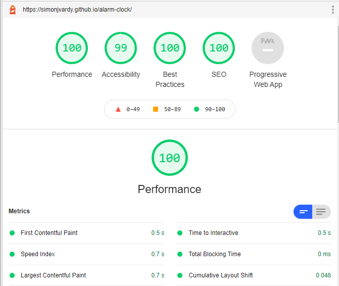
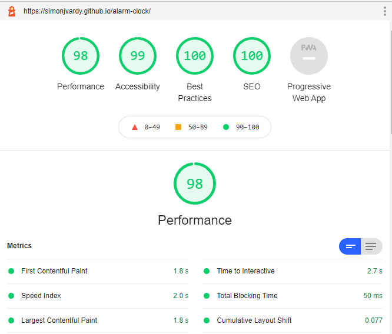
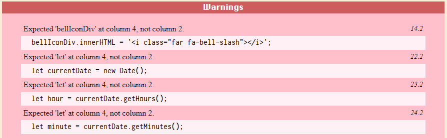
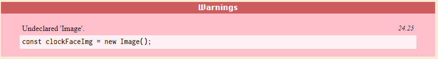
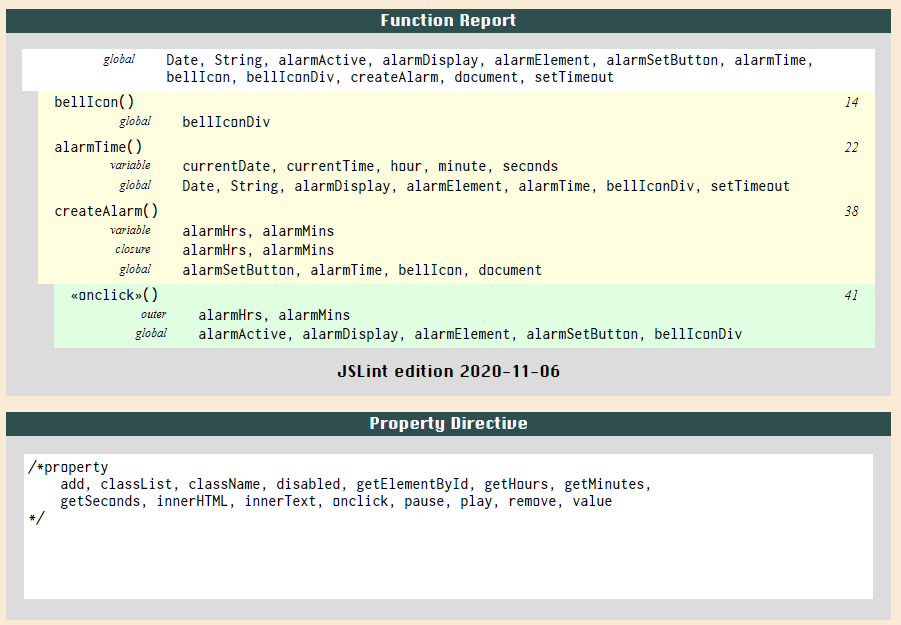
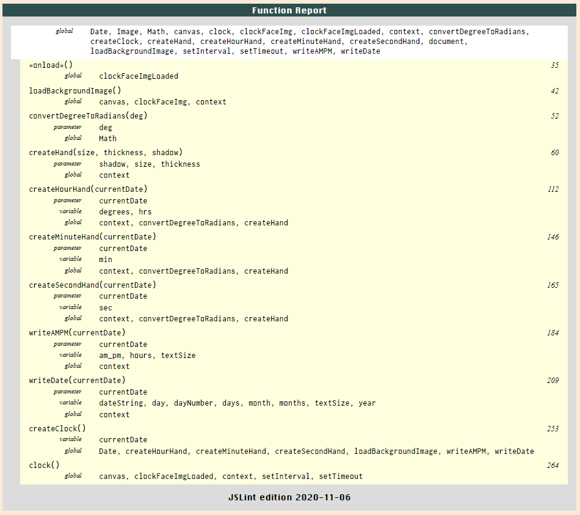
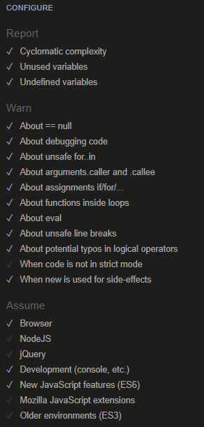
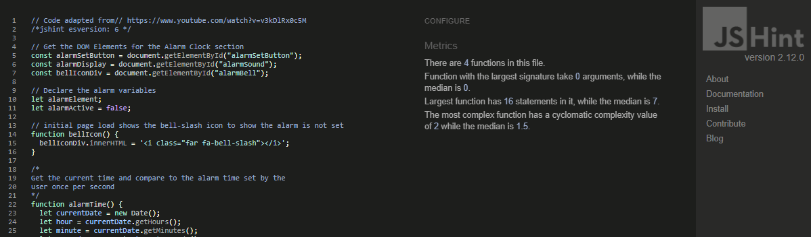
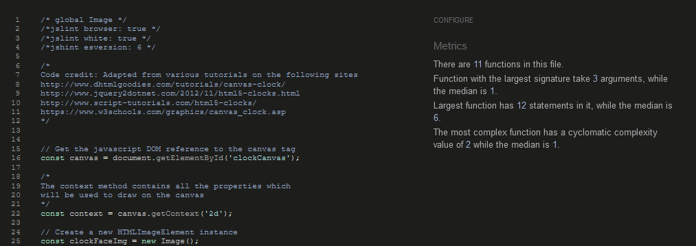

# alarm-clock Project Testing Details #

[Main README.md file](https://github.com/simonjvardy/alarm-clock/blob/master/README.md)

[View the live project here.](https://simonjvardy.github.io/alarm-clock/)

---

## Table of Contents ##

- [alarm-clock Project Testing Details](#alarm-clock-project-testing-details)
  - [Table of Contents](#table-of-contents)
  - [Automated Testing](#automated-testing)
    - [Validation Services](#validation-services)
  - [Manual Testing](#manual-testing)
    - [Unit Testing](#unit-testing)
    - [User Acceptance Testing (UAT)](#user-acceptance-testing-uat)
    - [Peer Code Review](#peer-code-review)
    - [Testing undertaken on desktop](#testing-undertaken-on-desktop)
    - [Testing undertaken on tablet and phone devices](#testing-undertaken-on-tablet-and-phone-devices)
  - [Bugs discovered](#bugs-discovered)
      - [Known Bugs](#known-bugs)
      - [Unsolved Issues](#unsolved-issues)

---
## Automated Testing ##

### Validation Services ###

The following **validation services** and **linters** were used to check the validity of the website code.

- [W3C Markup Validation](https://validator.w3.org/) 
  - This validator checks the markup validity of Web documents in HTML, XHTML, SMIL, MathML, etc.

- [W3C CSS validation](https://jigsaw.w3.org/css-validator/)
  - This validator checks the validity of cascading style sheets (css) and (X)HTML documents with style sheets.

- [Chrome DevTools Lighthouse](https://developers.google.com/web/tools/lighthouse)
  - An open-source automated tool for improving webpages by running audits for performance, accessibility, progressive web apps, SEO etc.

  - **Desktop Performance Report**
    
    

  - **Mobile Performance Report**

    

- [JSLint](https://jslint.com/)
  - JSLint is a code quality tool that detects errors and potential problems in JavaScript code.
  - The following option were selected to prevent  errors and warning being returned owing to the strict nature of the checking:
  

  - clock.js and alarm.js testing using JSLint passed the linter test successfully with the following selected options: 
    - Assume: a browser
      - This was required as JSLint is intolerant of DOM HTML `.getElementByID()` method.
    - Tolerate: single quote strings
       - This was needed to handle the font awesome bell icon `bellIconDiv.innerHTML = '<i class="far fa-bell-slash"></i>';` string.
    - Tolerate: this
      - Used in alarm.js function `alarmSetButton.onclick`
    - Tolerate: Whitespace mess
      - JSLint is very picky about whitespace at the end of comments as well as code. The .js files were cleansed of whitespaces but the odd one still lurks here or there giving frustrating errors. It's also very sensitive to indentation styles. 
        - The code is indented with the standard 2 spaces but triggers JSLint warnings
        
    - /\*global\*/ directive is used to instruct JSLint not to give undeclared 'Image' warnings when creating new HTMLImageElement instances.
    

    - **alarm.js results**
    

    - **clock.js results**
    

- [JSHint (version 2.12.0)](https://jshint.com/)
  - JSHint is a community-driven tool that detects errors and potential problems in JavaScript code.
  - The following option were selected to prevent  errors and warning being returned owing to the strict nature of the checking:

    

  - clock.js and alarm.js testing using JSHint passed the linter test successfully with the following selected additional option:
    - New JavaScript features (ES6)
      - This was selected as both scripts use ECMAScript 6 features such as `const`

  - **alarm.js results**
  
    

  - **clock.js results**
  
    

---
## Manual Testing ##

### Unit Testing ###
[Unit Testing document](testing/alarm-clock-unit-test-plan.pdf) containing:
- Unit Test scope,
- The test cases,
- The pass / fail record for each test case.

### User Acceptance Testing (UAT) ###
[UAT document](testing/alarm-clock-uat-test-plan.pdf) containing:
- UAT approach (scope, assumptions and constraints, team roles and responsibilities etc.), 
- Identified risks, 
- The test cases,
- The pass / fail record for each test case.

### Peer Code Review ###
The deployed website link was subjected to peer code review and testing:
- Code Institute Mentor - Narender Singh

### Testing undertaken on desktop ###

- Hardware:
    - Macbook Pro Laptop 17" (2009)
    - Dell 5590 Laptop
- Tested Operating Systems:
    - Windows 10
    - OSX 10.11 
- Tested Browsers:
    - Windows 10:
        - Chrome
        - Firefox
        - Edge 
    - OSX 10.11
        - Chrome
        - Firefox
        - Safari

### Testing undertaken on tablet and phone devices ###

- Hardware:
    - iPad Pro 12.9"
    - iPad Pro 10.5"
    - iPhone XS Max
- Tested Operating Systems:
    - iOS 14.2
    - iPadOS 14.2
- Tested Browsers:
    - iOS / iPadOS
        - Chrome
        - Firefox
        - Edge
        - Safari

---
## Bugs discovered ##

The issue log is managed on the [GitHub Project Issues section](https://github.com/simonjvardy/alarm-clock/issues) using the standard GitHub [bug\_report.md template](https://github.com/simonjvardy/alarm-clock/blob/master/.github/ISSUE_TEMPLATE/bug_report.md)

#### Known Bugs ####

[Issue #36:](https://github.com/simonjvardy/alarm-clock/issues/36)
- **Unit Test: No audio when testing the alarm sound on iPad**
  - The audio .mp3 file failed to play when the alarm was triggered on an iPad
  - This is a known problem described here: [WebKit Bugzilla](https://bugs.webkit.org/show_bug.cgi?id=132691).
    - HTMLAudioElement doesn't play with Javascript on mobile WebKit due to the Audio.play() can only be triggered by a user interactive click.
    - This is not going to be fixed as it is developer policy.
    - Possible alternative solution is to use WebAudio API instead.

[Issue #40](https://github.com/simonjvardy/alarm-clock/issues/40)
- **Unit Test: The Alarm set / clear button has a random black border in Chrome and Edge browsers**
  - The Alarm set / clear button displays black solid border when the button is clicked in Chrome and Edge browsers that isn't evident in Firefox or Safari browsers. The black button border disappears when the user mouse-clicks elsewhere on the page.
  - Dev Tools in both Edge and Chrome have not shown any css classes that are responsible for the border so far. It is suspected that this is a rendering style of the `<button>` element in Chrome and Edge that isn't present in Firefox or Safari.

#### Unsolved Issues ####

[Issue #4](https://github.com/simonjvardy/alarm-clock/issues/4)
- **Dev: How can I get 2 clocks to show on the same HTML page?**
  - The project originally needed to display two clocks: one for the user's local time and another showing the local time for a city searched for by the user; calling an API to Google Time Zones.
    - Creating a clock using the HTML5 canvas element context method proved difficult to achieve as each canvas context method needed to be associated with a unique ID.
    - Initial testing with async / await functions proved successful on Firefox browsers only; Chrome and Egde both failed to draw on both canvas elements. Further development is needed.

[Issue #11](https://github.com/simonjvardy/alarm-clock/issues/11)
- **Unit Test: Unable to get the background image to load with async / await functions**
  - The clock hands would fail to draw if the background image hadn't loaded. Due to the file size of the image asset the the clock function needed to be paused until the imge had fully loaded.
  - The use of an async / await function to ensure the background image loads before running the clock and provide error handling was an ideal solution
  - Initial errors caused by the `fetch(image_url)` method caused an `Uncaught TypeError: CanvasRenderingContext2D.drawImage: Argument 1 could not be converted to any of: HTMLImageElement, SVGImageElement, HTMLVideoElement, ImageBitmao.`
  - The `drawImage` expects its first argument as an image not a url string. A new image needed to be constructed using `let img = new Image();`
  - Further testing for issue #4 proved that async / await functions could be a solution but further testing and development is needed.
  - An alternative solution using `.onload` and a `setTimeout()` method proved a simple but successful way to wait for the background image to load.